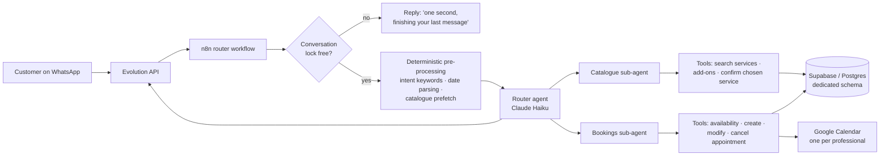

# WhatsApp booking agent for a beauty salon

> Multi-agent LLM system that books, changes and cancels appointments over WhatsApp for a salon with 200+ services and 8 professionals. In production with real customers.

**Stack:** n8n · Claude Haiku · Supabase (self-hosted Postgres) · Google Calendar · Evolution API (WhatsApp) · Docker Swarm on a VPS

---

## Context

A busy beauty salon in Spain (hair, nails, laser, waxing, aesthetics) was answering every booking request by hand on WhatsApp. The catalogue is large and messy: **215 active services**, 7 add-ons, prices that depend on hair length, and **8 professionals** where each service can only be done by some of them.

The goal: a WhatsApp assistant that can explain the catalogue, check real availability and book the right service with the right person — without ever inventing a service or a price.

## Architecture

- **11 core workflows, 168 nodes.** Every tool is its own sub-workflow with typed inputs, so it can be tested in isolation.
- **Conversation state lives in the database**, not in the model's memory: chosen service, confirmed date, pending question. The LLM reads it every turn.
- **Chat memory in Postgres**, versioned by session key so test conversations can be invalidated without deleting rows.

## Engineering decisions (and the bugs behind them)

### 1. Compute everything that can be computed — the LLM only writes the reply

**Bug:** the assistant listed 11 hair-highlight services that do not exist, with plausible names and prices.

**Root cause (two of them):** the intent classifier did not fire on short mentions like *"highlights"* or on follow-ups like *"the thick ones"*, so the model had no catalogue data and improvised. After fixing that, it still happened: the code that groups large result sets collapsed into one empty group when all services shared the same technique, so the sub-agent again received nothing real.

**Fix:** keyword classifier extended (41 → 64 terms) plus follow-up detection from the stored "last question asked"; the grouping logic moved entirely into a code node that returns ready-to-paste text. The model copies it; it no longer decides how to group or name anything.

**Lesson:** with a cheap model, prompt instructions for classifying, grouping or formatting fail *systematically*, not occasionally. When an LLM "hallucinates", check first what the deterministic code gave it.

### 2. Never auto-retry a write tool

**Bug:** a generic "if a tool fails, call it again" instruction produced **14 duplicate appointments**. The tool call had actually succeeded in the backend; only the response was slow or lost, so every retry created a real booking.

**Fix:** retries are allowed only for read-only tools. For write tools the rule is: *if you have no clear confirmation, check the real state with a read tool before doing anything else.*

### 3. One conversation, one execution at a time

**Bug:** two messages sent a second apart started two parallel executions that could both create the same booking.

**Fix:** a per-conversation lock table. First version dropped the second message silently; the final version replies *"one second, I'm finishing your previous message"* and processes it afterwards. Verified with bursts of 3 messages over real WhatsApp: none lost, no duplicates.

### 4. Empty values in database filters

**Bug:** when the phone number was empty, the lookup filter became `phone ILIKE '**'`, which matches **every** customer — the agent attached a test booking to a random real customer.

**Fix:** guard in all 4 sub-workflows that search by phone: empty input returns "not found" before building the query. Found during a full audit of the 11 workflows.

### 5. Don't trust the model to remember what the customer never said

**Bug:** the customer changed topic without answering a question, and the agent later acted as if she had answered it.

**Fix:** a "pending questions" rule shared by the three agents, plus the state table: confirmed fields stay `null` until the customer actually confirms them. Verified in the database after a real test.

### 6. Getting the data out of a platform with no export

The salon's previous booking SaaS had no public API and support never answered export requests. The data was extracted by **replaying the platform's internal API** (captured from the browser's network tab) with paginated requests. Result: 100% of customers with phone numbers (a manual CSV export had 4 out of 127), full catalogue with real service ↔ add-on relations, and **113 future appointments migrated** with their calendar events.

### 7. Self-hosted Supabase, one schema per client

Moved from a no-code database (record limits, no relational integrity) to self-hosted Supabase. Each client lives in its own Postgres schema instead of `public`, so a Row Level Security mistake in one project cannot touch another. A `pg_cron` job refreshes the PostgREST schema cache every 5 minutes, so new tables show up without restarting containers.

## Results

- In production on the salon's real WhatsApp number.
- 215 services, 7 add-ons and 8 professionals' calendars served from one database.
- 113 appointments migrated from the previous platform, with duplicates detected and resolved.
- Full audit: 11 workflows / 168 nodes reviewed, dead code removed, 0 validation errors.

## What I'd do differently

- Start with the deterministic layer (classification, data fetching, formatting) and add the LLM on top, instead of the other way round.
- Build the per-conversation lock and the "state in the database" pattern from day one — both were added after real incidents.
- Test write tools against a sandbox dataset only; never let a test path reach real customers or the real WhatsApp number.

---

*Client name and all personal data have been removed. Numbers come from the project's own audit and migration reports.*
