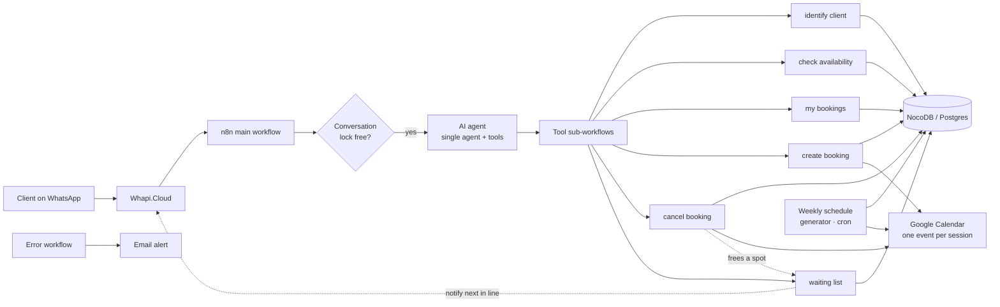

# WhatsApp booking agent for a functional-training studio

> Single LLM agent with a small tool set that let ~95 regular clients book, move and cancel group sessions over WhatsApp, with a first-come-first-served waiting list and automatic weekly schedules.

**Stack:** n8n · LLM agent with tool calling · NocoDB (on Postgres) · Google Calendar · Whapi.Cloud (WhatsApp) · Docker Swarm on a VPS

---

## Context

A personal trainer in southern Spain runs small-group functional training: sessions of **6 people max**, Monday to Friday, most clients coming at the same fixed times every week. Bookings, cancellations and "is there a spot at 7?" questions all arrived on his personal WhatsApp.

The goal: a WhatsApp assistant that knows each client, respects capacity, handles cancellations with a waiting list, and keeps his Google Calendar as the single place where he sees his day.

## Architecture

- **One agent, not a router.** Only one service and one resource (the trainer), so a single agent with a small, well-named tool set was simpler and more reliable than splitting it.
- **Modify = cancel + create**, both through the same tools, so there is only one code path that writes bookings.
- **Global error workflow** sends an email with the failing node and execution, so silent failures become visible.

## Engineering decisions (and the bugs behind them)

### 1. Verify success before confirming anything to the client

**Bug:** when a client moved a session, the cancel step failed silently (the tool node returned the error as if it were a normal answer) and the agent told the client *"done!"* — leaving **two active bookings** instead of one.

**Fix:** a hard rule at the top of the system prompt: the agent may only confirm an action if the tool response explicitly reports success; otherwise it checks the client's real bookings first. Found by testing over real WhatsApp, not in isolated runs.

### 2. Waiting list as a FIFO queue per session

When a spot frees up, the first person in line for **that exact session** gets a WhatsApp message offering it. States: *waiting → notified → confirmed / expired*. Bug found on the way: guest clients without a member ID broke the whole tool because an empty string was sent to a numeric column — normalised before insert.

### 3. Don't let the model answer on the client's behalf

**Bug:** the agent asked for the client's email, the client changed topic, and later the agent wrote *"no, I don't have an email registered"* as if the client had said it.

**Fix:** explicit "pending questions" rule covering the three real cases (email, new client's name, date confirmation): an unanswered question stays unanswered until the client replies.

### 4. Bulk operations: small batches driven from outside, never one giant loop

Loading a whole month for ~95 recurring clients inside a single n8n execution crashed the worker (and a Wait + webhook loop dropped items silently). The reliable pattern was **small batches triggered from outside**, each one idempotent and verifiable.

Result for September: **959 confirmed sessions, 200 unique calendar events, 0 duplicates, 0 bookings without a calendar event**, checked batch by batch.

### 5. Derive the weekly schedule from real behaviour, not from a spreadsheet

The "fixed schedule" field typed by hand turned out to be unreliable. A cron workflow now rebuilds each client's fixed slots **empirically** from confirmed bookings (a slot counts if the client attended it in at least 4 of the last 5 weeks) and generates the next month automatically. Tested with a simulation on far-future dates (370 sessions generated exactly, then cleaned up) before switching it on. October: 740 sessions generated.

### 6. Change the infrastructure when the data says so

- **Database:** started on a no-code database; the base hit its 1,000-record limit within weeks. Migrated to **NocoDB on self-hosted Postgres**: 9 workflows rewritten and tested end to end, no data lost.
- **WhatsApp provider:** the first open-source gateway reported messages as *sent* that never reached some users (a known issue with WhatsApp's new internal IDs). Switched to a managed provider (Whapi.Cloud); an 8-scenario checklist was re-run over real WhatsApp after the switch.

### 7. Avoid WhatsApp bans

Mass messages (e.g. "confirm your September schedule") are spaced out and sent progressively, and a freshly reconnected number is "warmed up" as a normal WhatsApp account for a few days before the bot is re-enabled.

## Results

- Around 95 recurring clients, with September and October fully scheduled (959 + 740 sessions).
- 0 duplicate bookings or orphan calendar events after the bulk-load process was redesigned.
- Two production migrations (database and WhatsApp provider) completed without losing bookings.

## What I'd do differently

- Put the "verify before confirming" rule and idempotent writes in from the first version.
- Remove every test node from production sub-workflows automatically (the silent-cancel bug came from a leftover test node).
- Choose the WhatsApp provider with account-safety in mind from day one: a banned number stops the whole product.

---

*Client name and all personal data have been removed. Numbers come from the project's own verification reports.*
