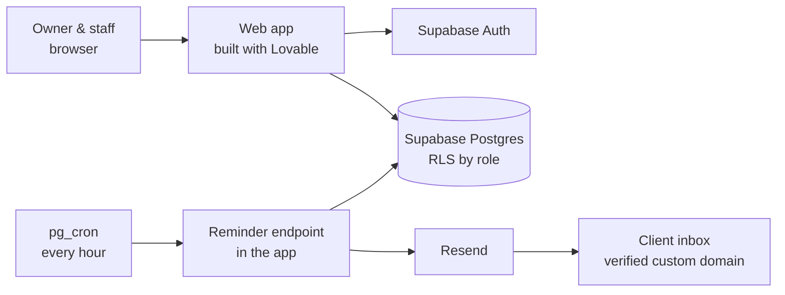

# Custom CRM for a small nail salon

> Internal web app (clients, appointments, payments, stats, automatic email reminders) built with an AI app builder on top of Supabase — for a one-off price and **~10 €/year** running cost.

**Stack:** Lovable (AI app builder) · Supabase (Postgres, Auth, RLS, `pg_cron`) · Resend (transactional email) · custom domain with SPF/DKIM/DMARC

---

## Context

A small nail salon in Spain (~200 clients) managed its agenda on paper and WhatsApp. The owner wanted her own CRM, used only by her and her team — not a public booking page.

The hard constraint came from the business, not from the tech: **one-off payment, no monthly fee.** That single requirement drove most of the architecture.

## What it does

- Clients with contact details, notes/allergies and full service history.
- Editable services with optional paid extras.
- Day/week calendar, simultaneous appointments, blocked days/hours.
- Appointment states: pending, paid, no-show, cancelled. Payment method (cash / card / Bizum) recorded at checkout.
- Stats: revenue, most requested service, no-show and cancellation rates.
- Automatic reminder email 24 h before **each** appointment.
- Two roles: admin (owner) and staff.

## Architecture

## Decisions

### 1. The pricing constraint decides the channels

WhatsApp reminders (~30 €/month) and SMS (~16–22 €/month) were both evaluated and rejected: any recurring cost breaks the "no monthly fee" promise. **Email** was the only channel that fits, and it only needs a domain (~10 €/year) to be deliverable.

### 2. Everything in the client's name

The app builder account and the Supabase project were created by the client, with the developer invited as a collaborator. Nothing depends on the consultant's own servers, so the client keeps working if the consultant disappears. For the same reason the reminders run on Supabase's own scheduler instead of the consultant's automation server.

An alternative AI app builder was also evaluated and rejected: its database and custom domain were locked behind paid plans, which would have broken the constraint even harder.

### 3. Roles enforced in the database, not in the UI

Row Level Security policies in Postgres: staff manage clients, appointments and payments; only the admin can create or edit services and assign roles. Hiding a button is not security; the database refuses the write.

### 4. A reminder per appointment, not a daily batch

First design: one job at 9:00 every day. Final design: `pg_cron` runs every hour and sends each reminder **exactly 24 h before that appointment**, computed in the `Europe/Madrid` time zone — so daylight-saving changes are handled with no manual work, and a 17:00 appointment is reminded at 17:00 the day before, not at 9:00.

### 5. Deliverability and secrets

- Custom domain verified in Resend with SPF, DKIM and DMARC records so reminders do not land in spam.
- Real bug on the way: the first test returned **401 "API key is invalid"** — the key had been pasted by hand into the wrong place. Fixed by using the builder's native OAuth connection to Resend instead of copying secrets manually.
- A domain search returned the punycode version of a name containing "ñ"; caught before paying.

### 6. Pay for the plan only while building

The paid plan of the app builder was only needed during construction. After confirming that hosting, the scheduled job and the email endpoint all work on the free tiers, the account was downgraded — final running cost is the domain only.

## Results

- Delivered in person and paid; the owner logged in with her own admin account on delivery.
- Reminder flow tested end to end with a real appointment and a real inbox.
- Running cost: **~10 €/year** (domain). Resend free tier (3,000 emails/month) covers the salon's volume many times over.

## Why this project is here

It is not an AI agent, and that is the point: choosing **not** to build a WhatsApp bot, because the client's budget made email the right answer, is as much an engineering decision as any architecture diagram.

---

*Business name, domain, URLs and all personal data have been removed.*
